# Solana Wormhole Contract Deployment

This readme describes the steps for building, verifying, and deploying Solana smart contracts for Wormhole.

**WARNING**: *This process is only Linux host compatible at this time.*

## Verify Tilt

Before building Solana contracts, ensure that the specific commit you will be building from passes in tilt.  This ensures the basic functionality of the Solana smart contracts that you are about to build and deploy.


## Build Contracts

The following command can be used to build contracts for Solana contracts via Docker.

Build Target Options: [`mainnet`|`testnet`|`devnet`]

These network names correspond to the naming convention used by wormhole
elsewhere. This means that `mainnet` corresponds to Solana `mainnet-beta`,
`testnet` corresponds to Solana `devnet`, and `devnet` is Solana `localhost`.

```console
wormhole/solana $ make NETWORK=BUILD_TARGET artifacts
```
Example: `make NETWORK=testnet artifacts`


Upon completion, the compiled bytecode for the Solana contracts will be placed into an artifacts directory with a convention of `artifacts-BUILD_TARGET` (eg. `artifacts-testnet`)

The contract addresses are compiled into the binaries, which is why these build
outputs are kept separate. The deploy script below makes sure that only the
right binaries can be deployed to each network.

You may set the build target in the `NETWORK` environment variable, and then
omit it from all of the subsequent commands.
Example:
```console
export NETWORK=testnet
make artifacts
```

## Verify Checksums

Now that you have built the Solana Contracts, you should ask a peer to build using the same process and compare the equivalent checksums.txt files to make sure the contract bytecode(s) are deterministic.

Verify Target Options: [`mainnet`|`testnet`|`devnet`]

```console
wormhole/solana $ cat artifacts-VERIFY_TARGET/checksums.txt
```
Example: `cat artifacts-testnet/checksums.txt`


Once you have verified the Solana contracts are deterministic with a peer, you can now move to the deploy step.

## Deploy Contracts

Now that you have built and verified checksums, you can now deploy one or more relevant contracts to the Solana blockchain.

Deploy Target Options: [`mainnet`|`testnet`|`devnet`]

You will need to define a `payer-DEPLOY_TARGET.json` for the relevant deploy target (eg. `payer-testnet.json`).  This will contain the relevant wallet private key that you will be using to deploy the contracts.

```console
wormhole/solana $ make NETWORK=DEPLOY_TARGET deploy/bridge
wormhole/solana $ make NETWORK=DEPLOY_TARGET deploy/token_bridge
wormhole/solana $ make NETWORK=DEPLOY_TARGET deploy/nft_bridge
```
Example: `make NETWORK=testnet deploy/bridge`

For each deployed contract, you will get an account address for that relevant account address for the deployment, make note of these so you can use them in the next step for on-chain verification.

## Verify On-Chain

Now that you have deployed one or more contracts on-chain, you can verify the onchain bytecode and make sure it matches the same checksums you identified above.

For each contract you wish to verify on-chain, you will need the following elements:

- Path to the contracts bytecode (eg. `artifacts-testnet/bridge.so`)
<!-- cspell:disable-next-line -->
- Solana account address for the relevant contract (eg. `9GRbmSbdrWGNf9z27YrhPbWnL7zZ3doeQAq2LrkmCB4Y`)
- A network to verify on (`mainnet`, `testnet`, or `devnet`)

Below is how to verify all three contracts on testnet:

<!-- cspell:disable -->
```console
wormhole/solana $ verify -n testnet artifacts-testnet/bridge.so NEW_BRIDGE_ACCOUNT_ADDRESS
wormhole/solana $ verify -n testnet artifacts-testnet/token_bridge.so NEW_TOKEN_BRIDGE_ACCOUNT_ADDRESS
wormhole/solana $ verify -n testnet artifacts-testnet/nft_bridge.so NEW_NFT_BRIDGE_ACCOUNT_ADDRESS
```
Example: `verify -n testnet artifacts-testnet/bridge.so 9GRbmSbdrWGNf9z27YrhPbWnL7zZ3doeQAq2LrkmCB4Y`
<!-- cspell:enable -->

Again, if you have the NETWORK environment variable set, then the `-n` flag is optional:
<!-- cspell:disable -->
```console
verify artifacts-testnet/bridge.so 9GRbmSbdrWGNf9z27YrhPbWnL7zZ3doeQAq2LrkmCB4Y
```
<!-- cspell:enable -->

For each contract, you should expect a `Successfully verified` output message.  If all contracts can be successfully verified, you can engage in Wormhole protocol governance to obtain an authorized VAA for the contract upgrade(s).

A verification failure should never happen, and is a sign of some error in the deployment process.

If you instead get `Failed to verify` for any contract, you can debug the differences between the compiled and on-chain byte code using `hashdump` and `vimdiff`.  The `verify` script temporarily caches bytecode in `/tmp/account.dump`, so you can run the verify command for a contract that doesn't verify and then debug as needed.

Below is an example of the commands you'd need to `hexdump` and `vimdiff` the differences in contract bytecode:

```console
wormhole/solana $ hexdump -C /tmp/account.dump > deployed.bin
wormhole/solana $ hexdump -C artifacts-testnet/bridge.so > compiled.bin
wormhole/solana $ vimdiff compiled.bin deployed.bin
```

Do not proceed with governance until you can verify the on-chain bytecode with the locally compiled bytecode.

# 🛰️ Wormhole & Token Bridge Fuzz Testing

## 📌 Overview
This repository implements **fuzz testing** for the [Wormhole](https://wormhole.com) and **Token Bridge** programs.  
The goal is to systematically validate critical functions, ensuring both **success paths** and **failure cases** are correctly handled.  

By simulating a wide range of **randomized inputs** and **edge cases**, this testing framework helps improve the **security, reliability, and robustness** of cross-chain message passing and token transfers.  

---

## 🏗 Architecture

```mermaid
flowchart TD
    Fuzz[Fuzz Testing]

    subgraph Wormhole
        A[post_message] --> A1[✓ success]
        A --> A2[x invalid_emitter]
        A --> A3[x math_overflow]
        A --> A4[x insufficient_fee]

        B[post_message_unreliable] --> B1[✓ success_case]
        B --> B2[x invalid_payload_length]
        B --> B3[x invalid_emitter]

        C[post_vaa] --> C1[✓ success_case]
        C --> C2[x consensus_fail]

        D[upgrade_contract] --> D1[✓ success_case]
        D --> D2[x invalid_guardian_key]

        E[upgrade_guardian_set] --> E1[✓ success_case]
        E --> E2[x invalid_guardian_set_upgrade]

        F[set_fees] --> F1[✓ success_case]
        F --> F2[x invalid_guardian_key]

        G[transfer_fees] --> G1[✓ success_case]
        G --> G2[x invalid_withdrawer]
    end

    subgraph TokenBridge
        H[register_chain] --> H1[✓ success_case]
        H --> H2[x invalid_vaa]

        I[attest_token] --> I1[✓ success_case]
        I --> I2[x non_existent_token_metadata_account]
        I --> I3[x wrong_account_owner]

        J[create_wrapped] --> J1[✓ success_case]
        J --> J2[x invalid_vaa]
        J --> J3[x wrong_account_owner]

        K[transfer_wrapped] --> K1[✓ success_case]
        K --> K2[x invalid_vaa]
        K --> K3[x invalid_mint]

        L[transfer_native] --> L1[✓ success_case]
        L --> L2[x invalid_mint]
        L --> L3[x invalid_recipient]

        M[complete_wrapped] --> M1[✓ success_case]
        M --> M2[x insufficient_funds]

        N[complete_native] --> N1[✓ success_case]
        N --> N2[x invalid_mint]
        N --> N3[x invalid_recipient]
    end

    Fuzz --> Wormhole
    Fuzz --> TokenBridge
```



---

## 🔑 Key Components

- **Wormhole Module**
  - `post_message`, `post_message_unreliable`, `post_vaa`
  - Administrative: `upgrade_contract`, `upgrade_guardian_set`, `set_fees`, `transfer_fees`
  - Handles message publication, governance, and fee transfers.

- **Token Bridge Module**
  - `register_chain`, `attest_token`, `create_wrapped`
  - Transfers: `transfer_wrapped`, `transfer_native`
  - Completions: `complete_wrapped`, `complete_native`
  - Handles token attestations, wrapping, and cross-chain transfers.

---

## 🚀 Testing Approach

1. **Fuzzing Input Generation**
   - Random and edge-case values generated for each instruction.
   - Covers metadata, token addresses, guardian sets, and VAA data.  

2. **Execution & Monitoring**
   - Transactions executed against Solana programs.
   - Capture logs, errors, and success states.  

3. **Assertions**
   - Compare results against expected outcomes:
     - ✅ **Success cases** must pass validation.  
     - ❌ **Failure cases** must return correct error codes.  

---

## 🧪 Example Test Scenarios

- **Wormhole**
  - `post_message` with insufficient fee → fail with `InsufficientFee`
  - `upgrade_guardian_set` with invalid guardian → fail with `InvalidGuardianSetUpgrade`

- **Token Bridge**
  - `attest_token` with non-existent metadata → fail with `NonExistentTokenMetadataAccount`
  - `transfer_wrapped` with invalid mint → fail with `InvalidMint`

---

## 📚 Resources

- [Wormhole Documentation](https://docs.wormhole.com)  
- [Solana Program Library](https://spl.solana.com)  
- [Fuzz Testing Guide](https://github.com/rust-fuzz/cargo-fuzz)  

---

✨ With this framework, every function in **Wormhole** and **Token Bridge** is validated against **success paths and multiple failure modes**, ensuring **security, correctness, and resilience** in cross-chain operations.  
